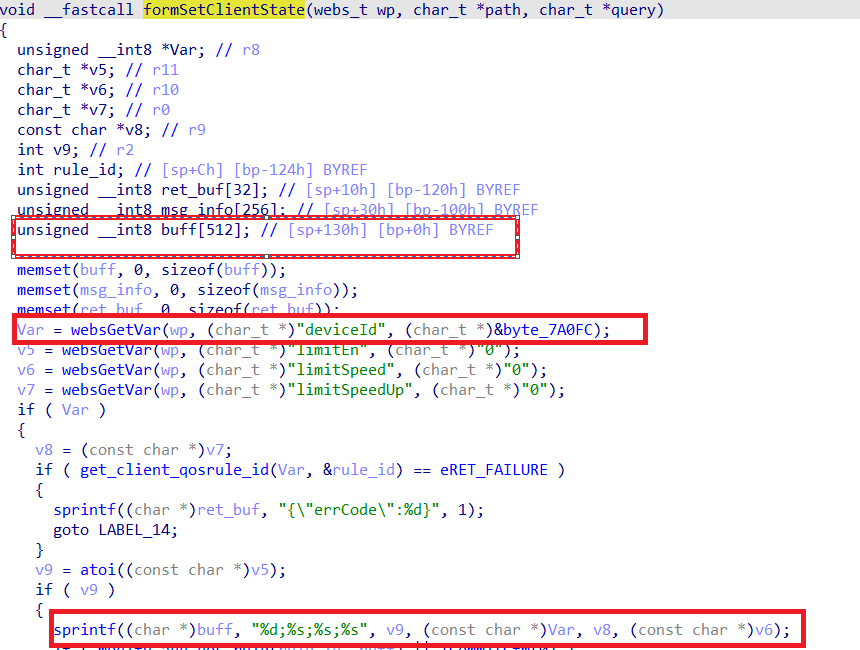

Binary Path: /bin/httpd
- Affected Versions
    - AX V16.03.12.11

In function `formSetClientState` it reads user provided parameter `deviceId` into `deviceid`, this variable is passed into function `sprintf` without any length check, which may overflow the stack-based buffer `buff`.

